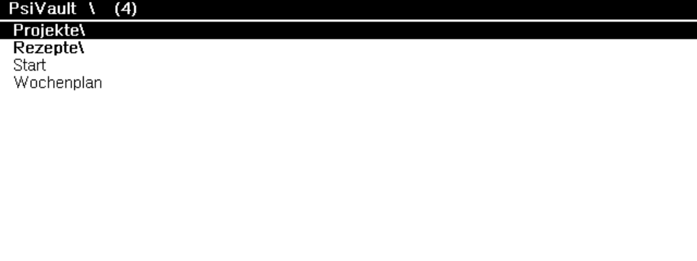
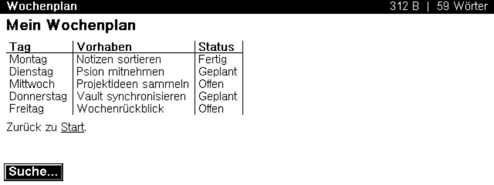
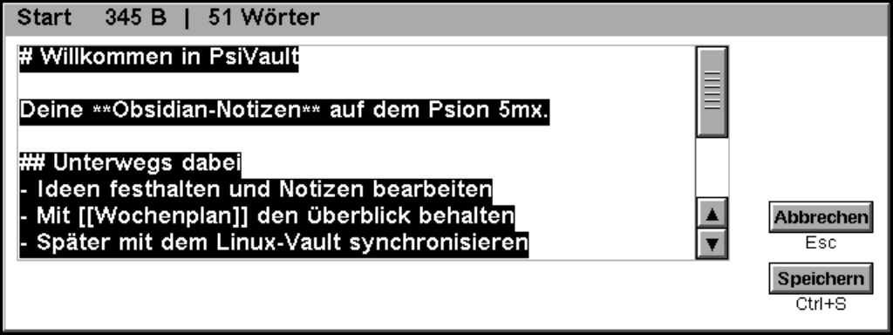

# PsiVault – Obsidian-light for the Psion 5mx

Folder browser, Markdown reading view, `[[wikilinks]]` with a back stack, editor,
full-text search, creating and deleting notes.

## Usage

- Browser: arrows / PgUp/PgDn / Home / End, Enter or → opens, Esc/← goes one level up.
  Pen: tap a line to select, tap again to open, title bar = one level up.
- Viewer: ↑↓ line by line, PgUp/PgDn or Space page by page, Home/End, Tab selects the
  next wikilink, Enter follows it, Esc/← goes back (link stack, then browser).
  Pen: tap a link to follow it, upper/lower half scrolls, title bar closes.
- Zoom of the reading view: sidebar magnifiers, keys **+**/**−** or the "View" menu
  (four levels, remembered). Menu via the Menu key or the sidebar icon.
- Shortcuts: **Ctrl-W** close note, **E** (or Ctrl-B) edit, **Ctrl-F** full-text search,
  **Ctrl-N** new note in the current folder, **Ctrl-D** delete note (with confirmation),
  Ctrl-R rebuild index, Ctrl-E quit.
- Editor: raw Markdown in `dEDITMULTI`, Ctrl-S saves, Esc discards. Notes up to 28 KB
  are edited in full; larger ones as an excerpt starting at the current line (the rest
  stays unchanged). Saving goes through a temporary file and a rename (`.tmp`/`.bak`).
  This is not a shared write lock with the sync. If the file was changed externally
  since it was opened (e.g. by a sync), your version is saved as
  `<name> (PsiVault YYYY-MM-DD HHMM).md`.
- Search: case-insensitive substring search across all notes; result list with a
  context line, Enter opens. All notes are read once for this.
- Markdown: headings, lists, quotes, horizontal rules, code blocks, `inline code`,
  **bold**, collapsed frontmatter, `[[wikilinks]]`, tables (bold header row, columns
  squeezed to the screen width, cells truncated with "…").
- The title bar of the reading view and the editor shows size and word count (from
  12 KB on, estimated as "~" in the reading view; always exact in the editor).
- The last opened folder is remembered in `C:\System\Apps\PsiVault\state.txt`.
- When started with a document (`CMD$(3)="O"`), the note is shown directly.

## Building

Prebuilt binaries: every [GitHub release](https://github.com/jfuerwentsches/psion-obsidian-notes/releases)
ships `PsiVault-vX.Y.Z.zip` with `PsiVault.app` and `PsiVault.aif`; skip to
[Device](#device) if you only want to install the app.

Requires Lua 5.4 and a checkout of OpoLua from <https://github.com/inseven/opolua>
(tested with commit `6bb10d5b60ce94abea20b9e1f0abb61d33218649`; the Qt runtime and
submodules are only needed for running the app on the desktop):

```sh
git clone https://github.com/inseven/opolua /tmp/psivault-opolua
git -C /tmp/psivault-opolua checkout 6bb10d5b60ce94abea20b9e1f0abb61d33218649
OPOLUA_DIR=/tmp/psivault-opolua bash app/build.sh
```

The output goes to `app/dist/`. The icon (`app/icon/*.bmp`, from
`docs/psion_5mx_appicon_package/`) is packed into `PsiVault.mbm` by `tools/make_mbm.lua`
and embedded in the AIF (masks inverted: EPOC shows the icon where the mask is black).
The OPL source is ASCII; umlauts in UI strings go through `CHR$`.
The app carries a temporary development UID.

## Tests without a device

The complete automated suite, including the OPL regression tests, runs with
`OPOLUA_DIR=/tmp/psivault-opolua REQUIRE_OPL_TESTS=1 .venv/bin/pytest`.
It builds in temporary directories, checks the results and limits run times.
Details and CI: [docs/testing.md](../docs/testing.md).

```sh
# Create a test vault in device encoding (CP1252/CRLF)
.venv/bin/psionsync --vault tests/fixtures/vault --state-dir /tmp/st --fake-device /tmp/fake sync --apply
# Key script through browser, viewer, frontmatter, wikilink
lua tools/smoke_app.lua /tmp/psivault-opolua "$PWD/app/dist" /tmp/fake/C/Vault
# Stress test: open a note "with document" and page through it
lua tools/smoke_app.lua /tmp/psivault-opolua "$PWD/app/dist" /tmp/fake/C/Vault 'C:\Vault\Projekte\Plan.md'
```

Qt runtime: populate `app/dist/PsiVault.system/c/` with
`System/Apps/PsiVault/PsiVault.app` and `Vault/` (ASCII names only, see
docs/psion-notes.md), then run
`/tmp/psivault-opolua/qt/opolua open app/dist/PsiVault.system/c/System/Apps/PsiVault/PsiVault.app`.

## Device

With `ncpd` running (see the [project README](../README.md)), copy the two build
outputs into `C:\System\Apps\PsiVault\`. This plptools version needs paths
relative to the current directory for `mkdir` and `put`:

```sh
cd app/dist
plpftp mkdir 'System\Apps\PsiVault'
plpftp put PsiVault.app 'System\Apps\PsiVault\PsiVault.app'
plpftp put PsiVault.aif 'System\Apps\PsiVault\PsiVault.aif'
plpftp get 'C:\System\Apps\PsiVault\PsiVault.app' check.app && cmp PsiVault.app check.app
```

The app then appears in the Psion's Extras bar. It reads and writes notes under
`C:\Vault\` and stores its own state under `C:\System\Apps\PsiVault\`.

Sync setup and Omarchy widget: [project README](../README.md).

## Emulator screenshots

The following captures come from the OpoLua Qt runtime with a small demo vault
and show the views implemented so far:







The PNGs are for visual documentation. The Qt runtime scales the 160×80 Psion
screen for display; font metrics and input feel on the real device still have to
be checked there.
